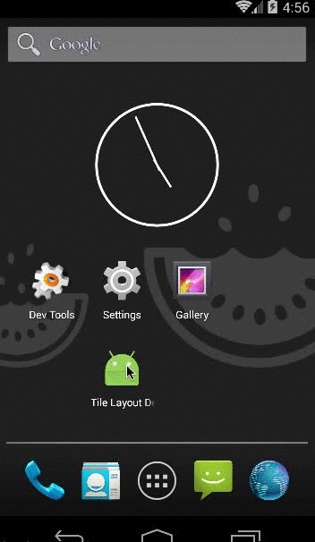

# Android Tile Layout
An android layout to load Tiles asynchronously using [AsyncAdapter](/library/src/main/java/com/rajasharan/tilelayout/adapters/api/AsyncAdapter.java) along with sample implementation of a simple 2D layer extending [AsyncAdapter&lt;Point&gt;](/library/src/main/java/com/rajasharan/tilelayout/adapters/SimpleTileAdapter.java)

## Demo


## Usage
[MainActivity.java](/demo/src/main/java/com/rajasharan/demo/MainActivity.java)
```java

@Override
protected void onCreate(Bundle savedInstanceState) {
    super.onCreate(savedInstanceState);
    setContentView(R.layout.activity_main);

    root = (TileLayout) findViewById(R.id.tiles);
    adapter = new SimpleTileAdapter(this);
    root.setAsyncAdapter(adapter);
}
```

[activity_main.xml](/demo/src/main/res/layout/activity_main.xml)
```xml

<com.rajasharan.tilelayout.TileLayout
    xmlns:android="http://schemas.android.com/apk/res/android"
    android:id="@+id/tiles"
    android:layout_width="match_parent"
    android:layout_height="match_parent"
    >
</com.rajasharan.tilelayout.TileLayout>
```

## AsyncAdapter&lt;T&gt; API
[AsyncAdapter](/library/src/main/java/com/rajasharan/tilelayout/adapters/api/AsyncAdapter.java)
provides API to retrieve Views in background represented by tags.
For eg: to retrieve views in a 2D surface you can tag the properties of the View from your data-model.
For reference implementation see [SimpleTileAdapter.java](/library/src/main/java/com/rajasharan/tilelayout/adapters/SimpleTileAdapter.java)
```java

/**
 * @return width of the view
 */
public abstract int getWidth()

/**
 * @return height of the view
 */
public abstract int getHeight()

/**
 * Returns the View represented by tag in your data-model.
 *
 * @param tag view's identifier tag from your data-model.
 * @return the default view is immediately returned and a message sent to Adapter-Thread to work on real view
 */
public final View getView(T tag)

/**
 * Return the default view while real view is being created in background.
 *
 * @param tag view's identifier in your data-model.
 * @return must immediately return default view
 */
protected abstract View getDefaultView(T tag)

/**
 * This method is called on non-UI background thread.
 * The real view can be created here from your data-model represented by tag.
 *
 * @param tag the view's identifier in your data-model.
 * @return the real view represented by tag in your data-model.
 */
public abstract View getViewInBackground(T tag)

/**
 * Intended to be called by the Root Layout that acts as an AdapterView and
 * needs its views to be available on an async basis.
 * <br>
 * Unless you are implementing your own ViewGroup don't call this method directly.
 */
public void setOnViewAvailableListener(OnViewAvailableListener<T> listener) {
    mListener = listener;
}

/**
 * Listener callback interface when View is available.
 */
public interface OnViewAvailableListener<T> {
    /**
     * This method is invoked when the newly created view is available.
     * <br>
     * <b>Note: </b> This method is inoked on non-UI background thread.
     * Use post(Runnable) to interact with UI thread.
     *
     * @param tag view's identifier in your data-model
     * @param view the newly created/available view.
     */
    void OnViewAvailable(final T tag, final View view);
}
```

## TODO
* yet to implement touch panning

## [License](/LICENSE)
    The MIT License (MIT)
